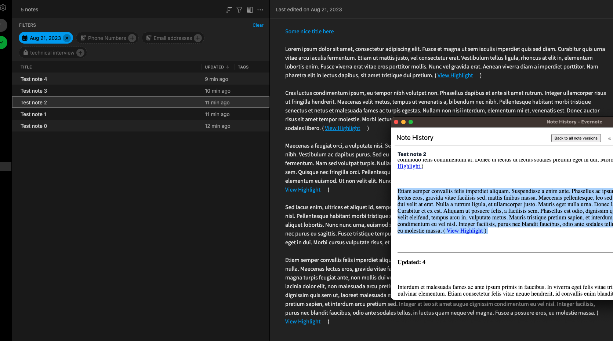

### Note: you must be running on python 3.8.12 (or lower) for this POC to work, as there is an issue with the evernote3 python library that does not allow higher versions.

To run:

```
EVERNOTE_AUTH_TOKEN="<YOUR_TOKEN_HERE>" python poc.py
```

This script will create 5 new notes, and then wait for 120 seconds. While the script is waiting, please open 1 or more of the new notes in Evernote web, and then close them.

After the 120s, the notes will be updated via API. You should reliably see that any note opened between creation and update does not show the appended text of update (unless you check the Note history).



